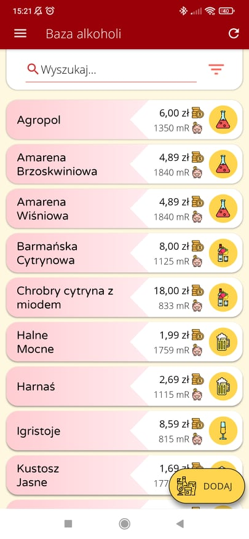
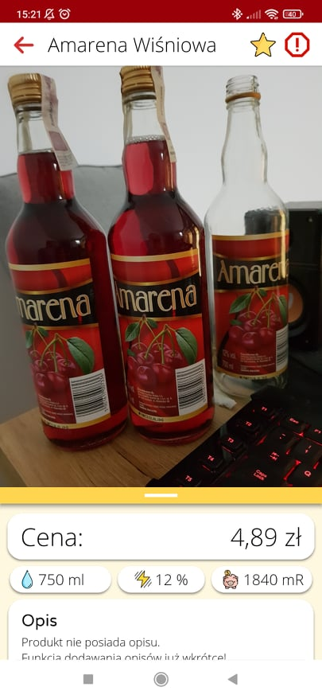
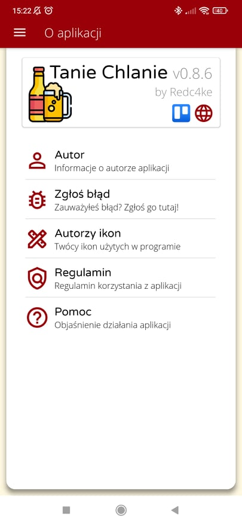
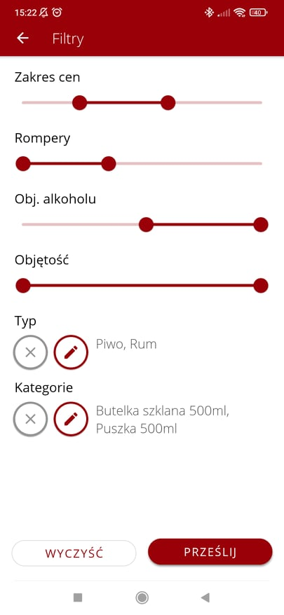
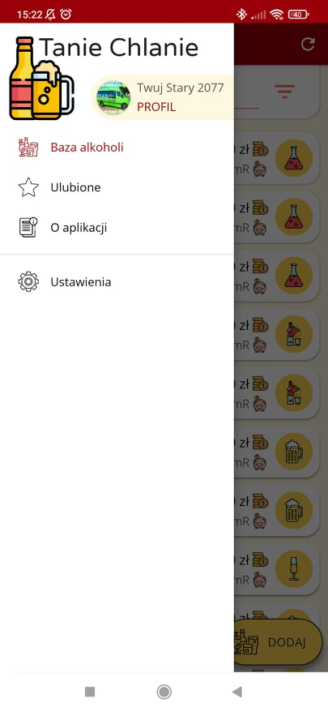

# TanieChlanie
My main project. Made purely for fun and practice, although I never thought I would make it this far since a lot of people turned out to be interested in this app.

It obviously lacks documentation due to a few reasons, mainly just because it is my personal project and I did not intend to involve more people in the development process.
All services are provided by Firebase, but this is subject to change, especially with notifications arrival.

Here are some more-or-less-actual screenshots:

